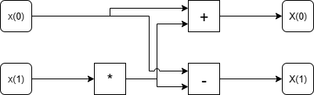
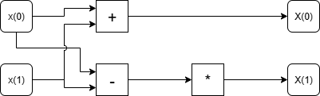
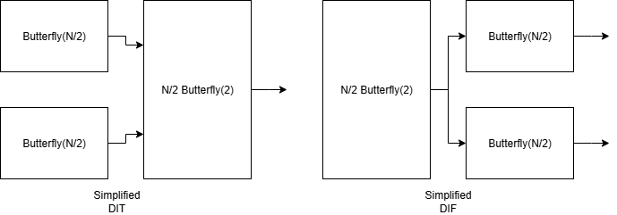

## Fast Fourier Transform Generator Library
This repository contains a library for generating RTL for the Fast Fourier Transform (FFT) algorithm using Chisel, a hardware construction language embedded in Scala.

Created as part of the "[Agile Hardware Design](https://github.com/schoeberl/agile-hw)" ([02201](https://kurser.dtu.dk/course/02201)) course at DTU.

This readme is best read with support for LaTeX math rendering enabled (such as in VSCode's Preview).

### Creators : Group 8
- Andreas Lildballe (s214387, [DreasL02](https://github.com/DreasL02))
- Lasse Slipsager (s224007, [lasseslips](https://github.com/lasseslips))
- Henrique Agostinho Loureiro dos Santos de Oliveira (s252981)

[Github commits](https://github.com/lasseslips/fft-core/commits/master/) accurately reflect individual contributions.

Elements of the UART implementation has previously been handed in and is not original work of the creators. See [the communication folder](./src/main/scala/communication/README.md) for more details.


### Features
- Parameterizable pipelined Butterfly FFT.
  - Supports both Decimation-In-Time (DIT) and Decimation-In-Frequency (DIF) architectures using respectively Cooley-Tukey and Gentleman-Sande butterflies.
  - Can be configured for different FFT sizes (powers of two).
  - Supports fixed-point number representation with customizable bit widths and fractional bits.
  - Uses a recursive architecture for easy scalability.
  - Supports both forward and inverse FFT operations.
- Modular design for easy integration into larger systems
  - Supports Ready/Valid handshaking for streaming data interfaces.
  - Possibility to supply inputs through a UART interface.
- Comprehensive testbench for functional verification using ChiselTest.
- FPGA test platform support for real-world performance evaluation.
- Optional scala and tcl building and synthesis scripts for evaluating performance on FPGA targets using Vivado.
  - Depends on having Vivado installed and accessible through WSL on Windows systems.
  - Not tested on Linux systems.

### Repository Structure
The repository follows a standard SBT-based Scala project structure, seperating source code and tests:

```
fft-core/
├── src/
│   ├── main/
│   │   ├── scala/
│   │   │   ├── buildtools/ - Scripts for building and synthesizing designs
│   │   │   ├── communication/ - UART and other communication protocol modules
│   │   │   ├── uart/ - A UART client to interface with the FFT
│   │   │   ├── utils/ - Utility functions and classes
│   │   │   ├── verifier/ - Verification and testing modules for getting golden model results
|   │   │   ├── Various modules and implementations, including Butterfly and FFT modules. Complex.scala includes complex number operations.
│   │   ├── tcl/


```

### Getting Started


## Motivation
The Fast Fourier Transform (FFT) is a fundamental algorithm in digital signal processing, which is widely used in applications such as audio processing, image analysis, telecommunications, and more.
In many of these applications, real-time processing is crucial to adhere to performance requirements. To achieve the lowest possible latency, the FFT is often implemented directly in hardware,
such as FPGAs or ASICs. Hardware implementations can exploit parallelism and pipelining to significantly speed up the computation compared to software implementations running on general-purpose processors.
These speedups can be many folds while still maintaining low power consumption, making hardware FFT implementations ideal for embedded systems and portable devices.

In this project, we implement a hardware accelerator for the FFT in Chisel, which can be accessed through a UART interface.
The project uses a hardware generator to automatically generate the necessary RTL code for different FFT sizes and configurations.
This allows for easy integration into existing designs, and makes it possible for the user to tailor the FFT to their specifications.

## Algorithm Explanation
The discrete fourier transform is defined by the equation:

$ X(k) = \sum_{n=0}^{N-1} x(n) \cdot e^{-j \frac{2 \pi}{N} k n} \quad \text{for } k = 0, 1, \ldots, N-1 $

where:
- $X(k)$ is the output frequency component at index $k$,
- $x(n)$ is the input time-domain sample at index $n$,
- $N$ is the total number of samples.

This sum can be computed directly, but it has a time complexity of O(N^2), which is inefficient for large N. The Fast Fourier Transform (FFT) algorithm reduces this complexity to O(N log N) by exploiting symmetries and redundancies in the computation.
This is achieved through a divide-and-conquer approach, recursively breaking down the DFT into smaller DFTs.

By splitting the sum into different parts, we can reduce the number of computations needed. One common method is the Cooley-Tukey algorithm, which recursively divides the DFT into smaller DFTs of even and odd indexed samples:

$ X(k) = \sum_{m=0}^{N/2-1} x(2m) \cdot e^{-j \frac{2 \pi}{N} k (2m)} + \sum_{m=0}^{N/2-1} x(2m+1) \cdot e^{-j \frac{2 \pi}{N} k (2m+1)} $

The next step can perhaps easily be seen by factoring out the exponentials:

$ X(k) = \sum_{m=0}^{N/2-1} x(2m) \cdot e^{-j \frac{2 \pi}{N/2} k m} + e^{-j \frac{2 \pi}{N} k} \cdot \sum_{m=0}^{N/2-1} x(2m+1) \cdot e^{-j \frac{2 \pi}{N/2} k m} $

Giving us two smaller DFTs of size N/2:

$ E(k) = \sum_{m=0}^{N/2-1} x(2m) \cdot e^{-j \frac{2 \pi}{N/2} k m} $

$ O(k) = \sum_{m=0}^{N/2-1} x(2m+1) \cdot e^{-j \frac{2 \pi}{N/2} k m} $

This can be further simplified using the periodicity and symmetry properties of the complex exponential function, leading to the use of "twiddle factors" which are precomputed complex exponentials that help combine the results of the smaller DFTs efficiently.

$ W_N^k = e^{-j \frac{2 \pi}{N} k} $

The syntax of the twidlle factors can be read as "W sub N to the power of k", where N is the total number of points in the FFT and k is the index of the twiddle factor.

$ X(k) = E(k) + W_N^k \cdot O(k) $


To efficiently combine the two half-size DFT results E(k) and O(k) into the full-size output X(k), the FFT uses small, fixed datapath units that perform the pairwise additions/subtractions and twiddle-factor multiplications required by the recurrence. These units are called "butterflies": each butterfly operates on two complex samples and a twiddle factor to produce two transformed outputs. By arranging butterflies in stages and connecting them according to either decimation-in-time (DIT) or decimation-in-frequency (DIF) ordering, the full N-point FFT is built from log2(N) stages of simpler operations. The next section describes the butterfly building blocks and the common architectures used to implement them in hardware.

### Butterfly architectures
The butterfly components are defined as the basic computing units, operating on two input samples, a twiddle factor, and producing two output samples. Two common architectures are the Cooley-Tukey Butterfly and the Gentleman-Sande Butterfly.

The former operates on the inputs $x_0$ and $x_1$ as: 

$ X_0 = x_0 + W_N^k \cdot x_1 $

$ X_1 = x_0 - W_N^k \cdot x_1 $

while the Gentleman-Sande Butterfly operates as:

$ X_0 = x_0 + x_1 $

$ X_1 = (x_0 - x_1) \cdot W_N^k $

Expanding the complex operations lay bare the hardware requirements for multipliers and adders/subtractors. A complex addition is defined as:

$(a + jb) + (c + jd) = (a + c) + j(b + d)$

A complex multiplication is defined as:

$(a + jb) \cdot (c + jd) = (ac - bd) + j(ad + bc)$

Applying these to Cooley-Tukey gives:

$Re\{X_0\} = Re\{x_0\} + Re\{W_N^k\} \cdot Re\{x_1\} - Im\{W_N^k\} \cdot Im\{x_1\}$

$Im\{X_0\} = Im\{x_0\} + Re\{W_N^k\} \cdot Im\{x_1\} + Im\{W_N^k\} \cdot Re\{x_1\}$

$Re\{X_1\} = Re\{x_0\} - Re\{W_N^k\} \cdot Re\{x_1\} + Im\{W_N^k\} \cdot Im\{x_1\}$

$Im\{X_1\} = Im\{x_0\} - Re\{W_N^k\} \cdot Im\{x_1\} - Im\{W_N^k\} \cdot Re\{x_1\}$

This contains four unique additions/subtractions and four multiplications. 

And for Gentleman-Sande:

$Re\{X_0\} = Re\{x_0\} + Re\{x_1\}$

$Im\{X_0\} = Im\{x_0\} + Im\{x_1\}$

$Re\{X_1\} = (Re\{x_0\} - Re\{x_1\}) \cdot Re\{W_N^k\} - (Im\{x_0\} - Im\{x_1\}) \cdot Im\{W_N^k\}$

$Im\{X_1\} = (Re\{x_0\} - Re\{x_1\}) \cdot Im\{W_N^k\} + (Im\{x_0\} - Im\{x_1\}) \cdot Re\{W_N^k\}$

This also contains four unique additions/subtractions and four multiplications.

The two approaches can be drawn out as follows for respectively DIT and DIF, noting operators are complex:






The arithmetic cost of the two approaches is clearly the same. However, the data flow and ordering of inputs and outputs differ, which can impact the overall FFT architecture.

### Building the FFT from butterflies 
Using the butterfly units, the FFT can be constructed in stages. Each stage consists of multiple butterflies operating in parallel on different pairs of inputs. The number of stages is determined by the size of the FFT (N), specifically log2(N) stages. The exact wiring and twiddle factor assignments will depend on whether the Cooley-Tukey or Gentleman-Sande approach is used for the butterflies. In the latter case the FFT is referred to as a Decimation-In-Frequency (DIF) FFT, while the former is known as a Decimation-In-Time (DIT) FFT.
The build up of the stages can be understood through small examples:

#### N = 2
With N=2, the FFT can be mathematically represented as (writing out the sums):

$ X(0) = x(0) + x(1) \cdot e^{-j \frac{2 \pi}{2} 0 \cdot 1} = x(0) + x(1) $

$ X(1) = x(0) - x(1) \cdot e^{-j \frac{2 \pi}{2} 1 \cdot 1} = x(0) - x(1) $

This is exactly what a single butterfly computes, given the twiddle factor will be respectively 1 and -1, and regardless of whether it is Cooley-Tukey or Gentleman-Sande. Thus, the N=2 FFT is simply one butterfly stage.

#### N = 4
For N=4, the FFT is mathematically represented as:

$ X(0) = x(0) + x(1) \cdot e^{-j \frac{2 \pi}{4} 0 \cdot 1} + x(2) \cdot e^{-j \frac{2 \pi}{4} 0 \cdot 2} + x(3) \cdot e^{-j \frac{2 \pi}{4} 0 \cdot 3} = x(0) + x(1) + x(2) + x(3)$

$ X(1) = x(0) + x(1) \cdot e^{-j \frac{2 \pi}{4} 1 \cdot 1} + x(2) \cdot e^{-j \frac{2 \pi}{4} 1 \cdot 2} + x(3) \cdot e^{-j \frac{2 \pi}{4} 1 \cdot 3} = x(0) + x(1) \cdot e^{-j \frac{2 \pi}{4} 1} + x(2) \cdot e^{-j \frac{2 \pi}{4} 2} + x(3) \cdot e^{-j \frac{2 \pi}{4} 3} = x(0) - x(1) \cdot j + x(2) - x(3) \cdot j $ 

$ X(2) = x(0) + x(1) \cdot e^{-j \frac{2 \pi}{4} 2 \cdot 1} + x(2) \cdot e^{-j \frac{2 \pi}{4} 2 \cdot 2} + x(3) \cdot e^{-j \frac{2 \pi}{4} 2 \cdot 3} = x(0) + x(1) \cdot e^{-j \frac{2 \pi}{4} 2} + x(2) \cdot e^{-j \frac{2 \pi}{4} 4} + x(3) \cdot e^{-j \frac{2 \pi}{4} 6} = x(0) - x(1) + x(2) - x(3) $

$ X(3) = x(0) + x(1) \cdot e^{-j \frac{2 \pi}{4} 3 \cdot 1} + x(2) \cdot e^{-j \frac{2 \pi}{4} 3 \cdot 2} + x(3) \cdot e^{-j \frac{2 \pi}{4} 3 \cdot 3} = x(0) + x(1) \cdot e^{-j \frac{2 \pi}{4} 3} + x(2) \cdot e^{-j \frac{2 \pi}{4} 6} + x(3) \cdot e^{-j \frac{2 \pi}{4} 9} = x(0) + x(1) \cdot j + x(2) - x(3) \cdot j $

Here we need two stages. Depending on whether we use DIT or DIF, the arrangement of butterflies and twiddle factors will differ, but both approaches will utilize two butterflies with the same twiddle factors as in the N=2 case.

For the DIT approach, we first compute two 2-point DFTs, identical to those used in the N=2 example above, on the even and odd indexed samples. This will compute intermedaite results:

$ E(0) = x(0) + x(2) $

$ E(1) = x(0) - x(2) $

$ O(0) = x(1) + x(3) $

$ O(1) = x(1) - x(3) $

These are then combined using butterflies with the twiddle factors $W_4^0 = 1$ and $W_4^1 = e^{-j \frac{2 \pi}{4} 1} = -j$ to produce the final outputs:

$ X(0) = E(0) + W_4^0 \cdot O(0) = (x(0) + x(2)) + 1 \cdot (x(1) + x(3)) = x(0) + x(1) + x(2) + x(3) $

$ X(1) = E(1) + W_4^1 \cdot O(1) = (x(0) - x(2)) + (-j) \cdot (x(1) - x(3)) = x(0) - j \cdot x(1) + x(2) + j \cdot x(3) $

$ X(2) = E(0) - W_4^0 \cdot O(0) = (x(0) + x(2)) - 1 \cdot (x(1) + x(3)) = x(0) - x(1) + x(2) - x(3) $

$ X(3) = E(1) - W_4^1 \cdot O(1) = (x(0) - x(2)) - (-j) \cdot (x(1) - x(3)) = x(0) + j \cdot x(1) - x(2) - j \cdot x(3) $

For the DIF approach, we first apply butterflies to adjacent pairs of inputs:

$ A_0 = x(0) + x(1) $

$ B_0 = x(0) - x(1) $

$ A_1 = x(2) + x(3) $

$ B_1 = x(2) - x(3) $

These intermediate results are then processed with two 2-point DFTs, where the second DFT incorporates the twiddle factors:

$ X(0) = A_0 + W_4^0 \cdot A_1 = (x(0) + x(1)) + 1 \cdot (x(2) + x(3)) = x(0) + x(1) + x(2) + x(3) $

$ X(1) = B_0 + W_4^1 \cdot B_1 = (x(0) - x(1)) + (-j) \cdot (x(2) - x(3)) = x(0) - j \cdot x(2) - x(1) + j \cdot x(3) $

$ X(2) = A_0 - W_4^0 \cdot A_1 = (x(0) + x(1)) - 1 \cdot (x(2) + x(3)) = x(0) - x(2) + x(1) - x(3) $

$ X(3) = B_0 - W_4^1 \cdot B_1 = (x(0) - x(1)) - (-j) \cdot (x(2) - x(3)) = x(0) + j \cdot x(2) - x(1) - j \cdot x(3) $


#### General case
Generalizing this to a arbitrary power-of-two size N, the main pattern for a DIT FFT is to first generate two of the half-size (N/2) FFTs from the even and odd indexed inputs using butterflies, and then combine these results with another stage of butterflies that apply the appropriate twiddle factors. This process is repeated log2(N) times, halving the problem size at each stage until reaching the base case of N=2 butterflies, which is taken as seen above and is the fundamental building block.

The DIF approach follows a similar recursive pattern, but starts with butterflies on adjacent input pairs and then applies half-size FFTs to the resulting sums and differences, incorporating twiddle factors in the second half-size FFT stage. This process is also repeated log2(N) times until reaching the N=2 base case.

This figure illustrates the general build up in the two different approaches, with a function Butterfly(N) representing the N-point FFT:



It should be noted that twiddle factors also become more complex as N increases, becoming roots of unity in the complex plane. I.e. for N=16, one twiddle factors would be:

$ W_{16}^1 = e^{-j \frac{2 \pi}{16} 1} = \cos\left(\frac{2 \pi}{16}\right) - j \sin\left(\frac{2 \pi}{16}\right) = 0.92388 - j \cdot 0.38268 $

This results in the need for a way of representing decimal numbers in hardware, which is discussed in the next section.

Another supported algortihm that is an easy extention is the Inverse Fast Fourier Transform (IFFT). The IFFT is defined by the equation:

$ x(n) = \frac{1}{N} \sum_{k=0}^{N-1} X(k) \cdot e^{j \frac{2 \pi}{N} k n} \quad \text{for } n = 0, 1, \ldots, N-1 $

The IFFT can be implemented by simply modifying the FFT algorithm to use the complex conjugates of the twiddle factors and scaling the output by 1/N. This involves changing the sign of the exponent in the twiddle factor calculation:
$ W_N^{-k} = e^{j \frac{2 \pi}{N} k}$.

## Number Representation
As floating-point arithmetic is an expensive operation in hardware, this design opts for fixed-point representation of numbers. Fixed-point numbers are represented with a total bit width and a specified number of fractional bits, allowing for efficient arithmetic operations while maintaining a balance between range and precision. It can be represented in Q(m.n) format, where m is the number of integer bits (including the sign bit) and n is the number of fractional bits.

The use of fixed-point arithmetic introduces quantization errors, which can accumulate through the stages of the FFT.
Addionally, one should note that multiplying two Q(m.n) numbers results in a Q(2m.2n) number, which may require truncation or rounding to fit back into the original format. This can introduce further quantization errors, and is especially important in systems where multiple multiplications occur, such as in the FFT.

## Design and Implementation
Two general approaches are clear for implementing the FFT. One is an unrolled architecture, where all butterflies and stages are instantiated in parallel, allowing for maximum throughput at the cost of increased resource usage. The other is a iterative architecture, where a single butterfly unit is reused across multiple clock cycles to process the FFT in stages, reducing resource usage at the cost of throughput.

This project opted for the former, unrolled architecture, as it allows for showcasing Chisel's capabilites in recursively generating hardware structures, in this case the butterfly stages. This is optimized for small to medium FFT sizes where resource usage is not prohibitive, and where high throughput is desired. If one wanted to target very large FFT sizes an iterative architecture would likely be more appropriate, though it also comes with complex memory mapping logic to ensure data is fed to the butterfly units in the correct order, as opposed to the generative unrolled architecture where the data flow is hardwired.

The implementation is structured around a generic [ButterflyN module](./src/main/scala/ButterflyN.scala) that recursively instantiates smaller Butterfly modules until reaching the base case of a [Butterfly module](.src/main/scala/Butterfly.scala) that implements the N=2 butterfly operation. 
The design supports both DIT and DIF architectures, selectable via a parameter, with Twiddle factors being supplied as an input, allowing for flexibility in twiddle factor generation and storage. Currently the example designs precompute the twiddle factors in Scala and supply them as a Vec to the top-level FFT module getting them hardcoded into the generated RTL.

An important part of unrolled designs is pipelining to ensure high clock frequencies can be achieved. Epcially in the FFT, where the data must traverse multiple stages of butterflies as N increases, pipelining is crucial to maintain throughput. In this design, pipeline registers are inserted inside the Butterfly module, both after the multiplier and another after the adders/subtractors. As there is only one multiplier and two adders/subtractors per butterfly, a register is inserted to balance the pipeline stage. 
This results in a latency of 2 clock cycles per butterfly stage, leading to a total latency of $2 \cdot \log_2(N)$ clock cycles for the entire FFT operation. 

The IFFT extension is implemented by a wrapper module that simply conjugates the twiddle factors and scales the output by 1/N. The 1/N scaling can be efficiently implemented using bit-shifting when N is a power of two, which is the case in this design.

To verify the functionality of the implementation, simulation is utilized, as described in the Testing section, but a on-FPGA test platform was also designed to evaluate real-world performance. This platform stores a series of test vectors in a block RAM, which are then passed onto the FFT. The results are then both stored back into another block RAM, and passed to a IFFT implementation. The IFFT results are then compared to the original input vectors and the FFT results are compared to precomputed expected results. The precomputed expected results are generated using the [Scala Breeze](https://github.com/scalanlp/breeze) library (and in earlier versions, Python's numpy). The comparisons keep in mind that quantization errors may occur due to the fixed-point representation and as such allow for a small error margin that is configurable but currently based on the Q-format used.

We also provide a [byte buffered version of the FFT module](./src/main/scala/BufferedFFT.scala) that can interface with byte-based communication protocols, such as UART. This version includes additional logic to handle the buffering and conversion of byte streams into the fixed-point format required by the FFT module, packaged into the wrapped [interfaced module](.src/InterfacedFFT.scala). Utilized in the buffered module is a ready/valid interface to manage the data flow. An example mapping to a UART module (see [communication readme for source](./src/main/scala/communication/README.md)) is also [provided](./src/main/scala/UartedFFT.scala) and has been tested on FPGA. It should be noted that the UART interface is relatively slow compared to the FFT processing speed, and as such the FFT will often be idle waiting for new data to arrive. For this reason the pipelining ability is not fully utilized in this configuration, only computing one FFT every time enough data has been received, rather than a continous stream of data. The pipelining here is therefore only useful for achieving timing closure.

One should note that there currently is no care taken to avoid overflow in the fixed-point arithmetic. In a production design, one would likely want to implement some form of scaling or saturation logic to prevent overflow and ensure numerical stability. This could be a shift in the fixed-point representation after each stage, which would reduce precision but increase the range of representable values and prevent overflow. This is left as future work.

## Testing
Testing is performed using the ChiselTest framework and relies in most cases heavily on testing randomized inputs to cover a wide range of scenarios and verifying them by comparison to a golden software model, in this case the computation performed using the Scala Breeze library. Tests were developed and adapted alongside the implementation to ensure correctness at each step of development.

For testing a simple Butterfly a small golden model has also been written of that, working in floating point and converting to fixed-point for comparison. 

One particular challenge was to account for pipeling latencies in the tests, especially in the main [ButterflyNSpec.scala](./src/test/scala/ButterflyNSpec.scala) where random inputs are continously fed into the FFT module every clock cycle. This required careful tracking of when outputs would be valid based on the number of pipeline stages and the latency introduced by each butterfly stage.

For [testing the UART interfaced module](./src/test/scala/UartedFTSpec.scala) important considerations was to reduce the test time as much as possible, as sending data byte-by-byte through a UART interface is inherently slow. To achieve this, the baudrate was set to 1 and the frequency to 100. This allowed for reducing the amount of clock cycles per byte sent, speeding up the overall test time significantly, though still resulting in tests taking multiple minutes to complete.

The FPGA test platform was also used for real-world verification of the design. This involved synthesizing the design for an FPGA target, programming the FPGA, and running the test vectors stored in block RAM. By lighting up LEDs based on the success or failure of the tests, we could quickly assess the correctness of the implementation in a real hardware environment and everything passed as expected.

## Synthesis and Performance


## Project Agility
As the project was conducted as part of the Agile Hardware Design course, we adopted agile methodologies to manage our development process effectively and we would like to also touch upon those. We utilized iterative development and continuous integration practices to ensure that our design evolved in response to the project requirements and time.

This is reflected in the current structure of the Butterfly modules. Files such as [Butterfly2.scala](./src/main/scala/Butterfly2.scala), [Butterfly4.scala](./src/main/scala/Butterfly4.scala), and [Butterfly8.scala](./src/main/scala/Butterfly8.scala) were developed iterating upon the previous and allowed for formalizing patterns and abstractions that could be reused in the final [ButterflyN.scala](./src/main/scala/ButterflyN.scala) implementation. The older patterns allowed for quick validation once the generative implementation was complete as it could be tested with known-good smaller instances. The tests were then further expanded to cover a wider range of sizes.

In [our continuous integration pipeline](.github/workflows/scala.yml), we set up automated testing using ChiselTest to validate our FFT implementation on every commit. This would in theory allow us to catch mistakes early and ensure that new features did not break existing functionality, but it only actually caught something during a brief moment where Python was required for a test and not installed on the CI runners.

This is probabily due to the relatively small group size and project scope, which made communication and coordination easier without the need for extensive agile practices. However, the experience provided valuable insights into how agile methodologies can be applied in hardware design projects.

One aspect that was a downside of the continous integration setup was that it developed a very localized setup, where something was only commited once it fully worked (largely due to the tests being developed alongside, if not before, the actual implementation). Perhaps something like branching could be used in future projects, but that also adds overhead and risk of complex merge conflicts.
## Conclusion & Future Work 

### Pipelined Radix-8 Implementation
One of the issues with our current implementation is that the generated RTL grows in a tree-like structure as N increases.
This leads to a rapid increase in the number of LUTs and DSP blocks required to implement the FFT, which for large N values can be infeasible.
A solution to this would be to reuse butterfly units in a more iterative model, thereby trading a small increase in latency for a significant reduction in LUTs and DSP blocks.

In the Paper ["Design of a radix-8/4/2 FFT Processor for OFDM systems"](https://class.ece.iastate.edu/cpre583/project_presentations/FFT_report.pdf) by Jungmin Park,
a pipelined radix-8 FFT architecture is presented in which butterfly units are reused across multiple clock cycles, reducing LUT and DSP usage.
The design includes a commutator unit that routes data into specific memory banks, ensuring that after each butterfly stage the results are correctly permuted and rotated.
This guarantees that the next stage can access its inputs in the proper order.

We attempted to implement this architecture in our design, but we encountered several issues during the process.
One issue was that the equation provided for the commutator unit only worked for the first-stage transformation.
As a result, we were only able to use the algorithm to compute a 64-point FFT and not larger sizes.
Combined with the difficulty of debugging the algorithm, this architecture was not feasible for our project within the given time constraints.


### Replacement of UART
Our project currently uses the UART module for I/O communication, which is relatively slow compared to the FFT processing speed.
A more efficient interface such as SPI or I²C could be used to increase the data transfer rate in an embedded system.
Furthermore, an Ethernet interface could also be implemented to enable high-speed data transfer between the FFT module and a host computer.


### Other DSP Features
This project could be extended to include additional DSP features such as convolution, correlation, and filtering. These operations are highly parallelizable and could therefore benefit significantly from hardware acceleration.


## References
